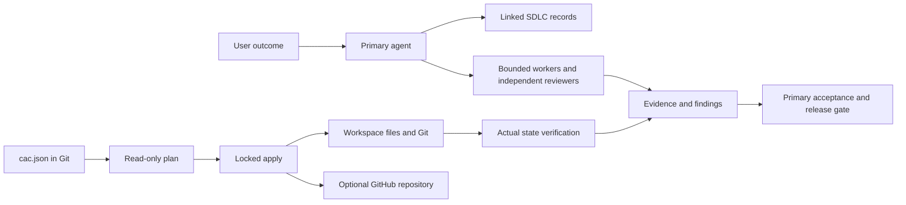

# Architecture and desired state



The manifest is desired configuration; `WORKBOARD.md` is the work ledger; `docs/changes` contains supporting lifecycle records. `.cac/state.json` is a disposable local ownership cache, never a competing source of intent. The engine does not run a daemon or a language model.

## Manifest

```json
{
  "apiVersion": "cac/v1",
  "kind": "Workspace",
  "metadata": {"name": "example"},
  "spec": {
    "git": {"enabled": true, "defaultBranch": "main"},
    "directories": ["docs/changes"],
    "files": [{"path": "hello.txt", "content": "Hello\n"}]
  }
}
```

The generated manifest contains the actual template text, so routine plan and apply do not fetch templates from the network. Unknown properties, duplicate paths, case collisions, traversal, absolute paths, protected metadata paths and unsafe symlinks are rejected.

Optional `spec.github` has exactly `repository` (`OWNER/NAME`) and `visibility` (`private` or `public`). A plan reads GitHub state. Remote creation requires `--allow-remote`. Existing visibility mismatches and conflicting origins fail; there is no visibility conversion, credential creation, automatic commit or automatic push. A repository's absence is distinguished from other API errors.

## Reconciliation and limits

Each managed file has a desired content hash. Missing files are created. Identical existing files are adopted. An unchanged previously managed file can be updated to new desired content. Differing unowned or locally edited files are conflicts. The engine preflights all known conflicts before writing and rechecks while holding the local writer lock.

Updates and state writes use atomic replacement. An entire apply is not a transaction: disk failure or interrupted remote communication can leave partial state. A retry inspects observed resources first. Definitions removed from a manifest are not automatically deleted. Git branch settings are used for bootstrap; the engine preserves normal branch-based development.

State hash files and the lock are local coordination aids, not an adversarial security boundary. A process with equivalent filesystem privileges can modify them. Git review, operating-system permissions, hosting controls, independent review and target readback remain necessary.

## Extension contract

An additional provider needs a validated declarative schema, read-only inspect/plan, explicit apply authority, stable resource identity, idempotency, concurrency behavior, conflict and failure semantics, import/adoption rules, real verify, rollback/retirement guidance and regression tests. Do not add arbitrary shell execution to the manifest as a substitute for a provider.
